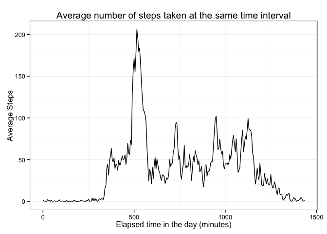

# Reproducible Research: Peer Assessment 1


## Loading and preprocessing the data

1. Obtaining and loading the data. (This step is internally cached)

```r
# Unzip "activity.zip", parse and store as a frame.data:
data <- read.csv(unz("activity.zip","activity.csv")) 
```
2. Explore and Prepocess the data:

```r
tail(data)
```

```
##       steps       date interval
## 17563    NA 2012-11-30     2330
## 17564    NA 2012-11-30     2335
## 17565    NA 2012-11-30     2340
## 17566    NA 2012-11-30     2345
## 17567    NA 2012-11-30     2350
## 17568    NA 2012-11-30     2355
```
The "interval"" column encodes the hour and minute in a same integer.
Since the total number of minutes in the day will be used later, 
let us add two new columns: 

```r
# Note that the following won't work:
# (strptime(paste(data$date,data$interval),"%Y-%m-%d %H%M")) # This would yield some NA
# Instead, lets isolate the number of hours and multiply by 60 and to the remaining time:
data<-transform(data,Hour=floor(interval/100)) # New column indicating the Hour (0 to 23)
data<-transform(data, Minute=interval-Hour*100 + Hour*60) # New column indicating the total number of minutes in a Day  (0 to 1435)
```
Now let us print a beauty summary of the data including the two new colums:

```r
library(xtable)
print( xtable(summary(data)),type="html")
```

<!-- html table generated in R 3.1.2 by xtable 1.7-4 package -->
<!-- Sat Nov 15 14:51:02 2014 -->
<table border=1>
<tr> <th>  </th> <th>     steps </th> <th>         date </th> <th>    interval </th> <th>      Hour </th> <th>     Minute </th>  </tr>
  <tr> <td align="right"> 1 </td> <td> Min.   :  0.00   </td> <td> 2012-10-01:  288   </td> <td> Min.   :   0.0   </td> <td> Min.   : 0.00   </td> <td> Min.   :   0.0   </td> </tr>
  <tr> <td align="right"> 2 </td> <td> 1st Qu.:  0.00   </td> <td> 2012-10-02:  288   </td> <td> 1st Qu.: 588.8   </td> <td> 1st Qu.: 5.75   </td> <td> 1st Qu.: 358.8   </td> </tr>
  <tr> <td align="right"> 3 </td> <td> Median :  0.00   </td> <td> 2012-10-03:  288   </td> <td> Median :1177.5   </td> <td> Median :11.50   </td> <td> Median : 717.5   </td> </tr>
  <tr> <td align="right"> 4 </td> <td> Mean   : 37.38   </td> <td> 2012-10-04:  288   </td> <td> Mean   :1177.5   </td> <td> Mean   :11.50   </td> <td> Mean   : 717.5   </td> </tr>
  <tr> <td align="right"> 5 </td> <td> 3rd Qu.: 12.00   </td> <td> 2012-10-05:  288   </td> <td> 3rd Qu.:1766.2   </td> <td> 3rd Qu.:17.25   </td> <td> 3rd Qu.:1076.2   </td> </tr>
  <tr> <td align="right"> 6 </td> <td> Max.   :806.00   </td> <td> 2012-10-06:  288   </td> <td> Max.   :2355.0   </td> <td> Max.   :23.00   </td> <td> Max.   :1435.0   </td> </tr>
  <tr> <td align="right"> 7 </td> <td> NA's   :2304   </td> <td> (Other)   :15840   </td> <td>  </td> <td>  </td> <td>  </td> </tr>
   </table>

## What is mean total number of steps taken per day?
For this part of the assignment, you can ignore the missing values in the dataset.

1. Histogram of the total number of steps taken each day:

```r
# Compute the accumulated number of steps per day (ignoring NA):
Steps<-tapply(data$steps,data$date,function(x){sum(x,na.rm=TRUE)})
# Transforms name strings into  POSIXlt dates
Day<-strptime(names(Steps),"%Y-%m-%d")
# Ensure dates Dates will be displayed  in English
localset <- Sys.setlocale("LC_ALL","C") 
# Bar plot with ggplot2
library(ggplot2)
p<-qplot(Day, Steps, geom="bar", stat="identity", main="Histogram: Distribution of the number of steps per day")
print(p+theme_bw())
```

 

2. Mean and median total number of steps taken per day:

```r
cat(sprintf("Mean daily steps: %g \nMedian of the daily steps: %g", mean(Steps,na.rm=TRUE),median(Steps,na.rm=TRUE)))
```

```
## Mean daily steps: 9354.23 
## Median of the daily steps: 10395
```

## What is the average daily activity pattern?
1. Time series: Minutes vs. number of steps taken at that time averaged across all days: 

```r
# Compute the steps on an 5min-interval averaged-across-days:
MeanStepsByMinute= tapply(data$steps,data$Minute,function(x){mean(x,na.rm=TRUE)})
# Sanity Check: The mean of means must be equal to the mean: 
mean(MeanStepsByMinute) == mean(data$steps,na.rm=T)
```

```
## [1] TRUE
```

```r
# Compute the elapsed minutes corresponding to MeanStepsByMinute:
Minute=as.numeric(names(MeanStepsByMinute));
p<-qplot(Minute, MeanStepsByMinute, geom="line", main="Average number of steps taken at the same time interval" ,xlab="Elapsed time in the day (minutes)", ylab="Average Steps")
print(p+theme_bw())
```

 


2. 5-minute interval with maximum average-across-days number of steps:

```r
NumberOfInterval=which.max(MeanStepsByMinute)
EllapsedMinutes=Minute[which.max(MeanStepsByMinute)]
TimeHour=floor(EllapsedMinutes/60)
TimeMinute=EllapsedMinutes-TimeHour*60
cat(sprintf("Number of interval: %g .\n Elapsed Time in the day: %g minutes, i.e, Time: %2d:%2d", NumberOfInterval,EllapsedMinutes, TimeHour,TimeMinute ))
```

```
## Number of interval: 104 .
##  Elapsed Time in the day: 515 minutes, i.e, Time:  8:35
```

```r
Minute[which.max(MeanStepsByMinute)]
```

```
## [1] 515
```

## Imputing missing values

1. Number of missing values (i.e. the total number of rows with NAs)

```r
# Vector with rows containing no missing values:
missing=!complete.cases(data)
Nmissing=sum(missing)
cat(sprintf("Number of rows containing missing values: %d .\n ", Nmissing ))
```

```
## Number of rows containing missing values: 2304 .
## 
```

2. Filling missing values in the dataset. 
For the  shake of simplicity, here we will use the mean. 
However, it should be noted that the EM algorithm is a better approach,
since it preserves the covariance structure of the data.

```r
# a) Rows with missing values:
whichmissing=which(missing); 
# b) Find the Corresponding elapsed time in the day (minutes) 
missingMinute=(data$Minute)[whichmissing]
# c)  Map the elapsed time to the index in the Averaged Steps per day on a 5-min time interval. This can be easily done thanks to the addtional column "Minute" computed at the very begging of this work.
missingIndexInMeanStepsByMinute=1+missingMinute/5 
# d) Obtain the means for the missing values, using the averages-across-days computed before
missingMeanStepsByMinute=MeanStepsByMinute[missingIndexInMeanStepsByMinute] 
```

3. Create a new dataset that is equal to the original dataset but with the missing data filled in.

```r
newdata = data
newdata$steps[whichmissing] <- missingMeanStepsByMinute # imputation of the corresponding means
```


4.a Histogram of the total number of steps taken each day.
  *(NOTE: Question 4 is split into three different steps: See below)*

```r
# Compute the accumulated number of steps per day (ignoring NA):
newSteps<-tapply(newdata$steps,newdata$date,sum) 
# Days that have a different number of total steps now:
#    names(which((newSteps-Steps) != 0))
# Bar plot with ggplot2
p<-qplot(Day, newSteps, geom="bar", stat="identity", main="Histogram: Distribution of the number of steps per day, with mean impuatation")
print(p+theme_bw())
```

 

4.b Mean and median total number of steps taken per day.
Do these values differ from the estimates from the first part of the assignment? **Yes, they do, as expected**

```r
cat(sprintf("Mean daily steps: %g \nMedian of the daily steps: %g", mean(newSteps),median(newSteps)))
```

```
## Mean daily steps: 10766.2 
## Median of the daily steps: 10766.2
```

4.c What is the impact of imputing missing data on the estimates of the total daily number of steps? **As expected, the mean total daily steps does not vary ; but variance does. **

```r
# Check:
newMeanStepsByMinute= tapply(newdata$steps,newdata$Minute,mean)
# As expected! There are no differences in the averaged steps per interval accross all days, because of the imputation method
cat(sprintf("Number of days in which the mean daily steps have changed: %d", sum((newMeanStepsByMinute-MeanStepsByMinute !=0))))
```

```
## Number of days in which the mean daily steps have changed: 0
```

```r
# However, almost  variances have changed:
SdStepsByMinute= tapply(data$steps,data$Minute,function(x){sd(x,na.rm=TRUE)})
newSdStepsByMinute= tapply(newdata$steps,newdata$Minute,sd)
cat(sprintf(" Number of days in which the variance of the number of steps have changed: %d", sum((newSdStepsByMinute-SdStepsByMinute !=0))))
```

```
##  Number of days in which the variance of the number of steps have changed: 269
```

```r
# Relative Average change in the variances:
cat(sprintf("Relative average decrease in variance : %2.2g%%",  mean((newSdStepsByMinute-SdStepsByMinute)/SdStepsByMinute*100,na.rm=TRUE)))
```

```
## Relative average decrease in variance : -6.9%
```

## Are there differences in activity patterns between weekdays and weekends?
1. New  new factor variable in the dataset with two levels **weekday** and **weekend** 

```r
# Convert dates (previously stored into Day) to numeric weekday (monday=1).
#  Add a factor var. to newdata with level True if the date corresponds to the weekend:
newdata<- transform(newdata,daytype=factor(format(Day,"%u")>5 , labels=c("weekday","weekend")))
# Print some data
print( xtable(tail(newdata)),type="html")
```

<!-- html table generated in R 3.1.2 by xtable 1.7-4 package -->
<!-- Sat Nov 15 14:51:04 2014 -->
<table border=1>
<tr> <th>  </th> <th> steps </th> <th> date </th> <th> interval </th> <th> Hour </th> <th> Minute </th> <th> daytype </th>  </tr>
  <tr> <td align="right"> 17563 </td> <td align="right"> 2.60 </td> <td> 2012-11-30 </td> <td align="right"> 2330 </td> <td align="right"> 23.00 </td> <td align="right"> 1410.00 </td> <td> weekend </td> </tr>
  <tr> <td align="right"> 17564 </td> <td align="right"> 4.70 </td> <td> 2012-11-30 </td> <td align="right"> 2335 </td> <td align="right"> 23.00 </td> <td align="right"> 1415.00 </td> <td> weekday </td> </tr>
  <tr> <td align="right"> 17565 </td> <td align="right"> 3.30 </td> <td> 2012-11-30 </td> <td align="right"> 2340 </td> <td align="right"> 23.00 </td> <td align="right"> 1420.00 </td> <td> weekday </td> </tr>
  <tr> <td align="right"> 17566 </td> <td align="right"> 0.64 </td> <td> 2012-11-30 </td> <td align="right"> 2345 </td> <td align="right"> 23.00 </td> <td align="right"> 1425.00 </td> <td> weekday </td> </tr>
  <tr> <td align="right"> 17567 </td> <td align="right"> 0.23 </td> <td> 2012-11-30 </td> <td align="right"> 2350 </td> <td align="right"> 23.00 </td> <td align="right"> 1430.00 </td> <td> weekday </td> </tr>
  <tr> <td align="right"> 17568 </td> <td align="right"> 1.08 </td> <td> 2012-11-30 </td> <td align="right"> 2355 </td> <td align="right"> 23.00 </td> <td align="right"> 1435.00 </td> <td> weekday </td> </tr>
   </table>

2. Time series of the 5-minute interval vs. the average number of steps taken, averaged across all weekday days or weekend days.

```r
# Plot
p<-qplot(Minute, steps, data=newdata, stat="summary", fun.y="mean", facets =. ~ daytype, geom="line", main="Average number of steps taken at the same time interval" ,xlab="Elapsed time in the day (minutes)", ylab="Average Steps")
print(p+theme_bw())
```

 
